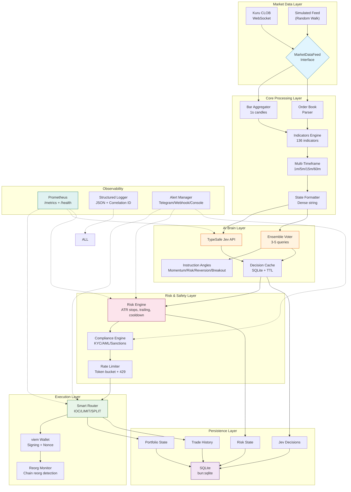
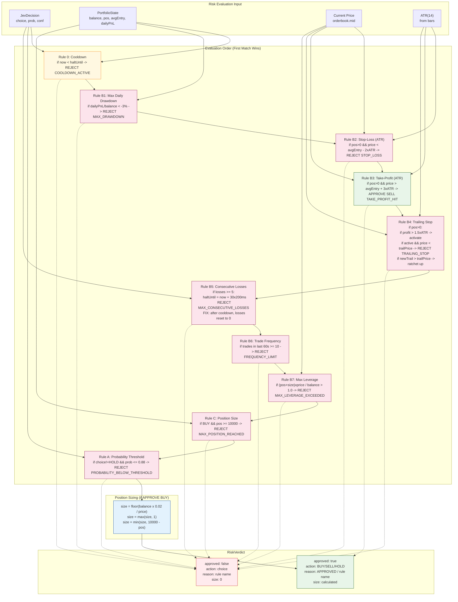
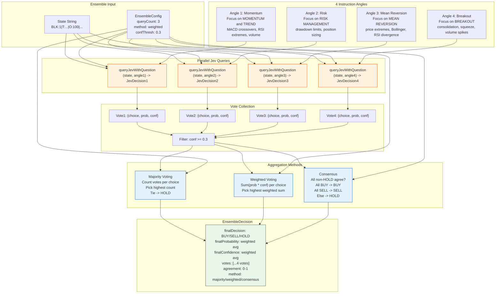

# Cerebro Trader

> **AI-powered on-chain CLOB trading bot** — TypeSafe Jev brain on Monad

[](https://github.com/sudish80/Cerebro/actions/workflows/ci.yml)
[](LICENSE)

---

## Overview

Cerebro Trader is a production-grade autonomous trading bot that operates on the **Monad blockchain** using the **Kuru CLOB (Central Limit Order Book)**. Its decision-making brain is powered by **TypeSafe's Jev framework** — an AI system that evaluates market state and returns probabilistic trading signals (BUY/SELL/HOLD).

### Key Features

| Category | Capabilities |
|----------|--------------|
| **AI Brain** | TypeSafe Jev integration with ensemble voting (momentum/risk/mean-reversion/breakout angles) |
| **Indicators** | 136 technical indicators across 4 timeframes (1m, 5m, 15m, 60m) |
| **Risk Engine** | ATR-based stops, trailing stops, consecutive-loss cooldown, frequency gates, leverage enforcement |
| **Execution** | Smart order router (IOC/LIMIT/SPLIT), nonce management, dry-run mode, gas estimation |
| **Market Data** | Real WebSocket feed (Kuru CLOB) + simulated feed for testing |
| **Wallet** | viem-based signing, multi-chain support (Monad testnet/mainnet) |
| **Persistence** | SQLite (via `bun:sqlite`) — portfolio, risk state, trade history |
| **Observability** | Prometheus `/metrics`, `/health` endpoint, structured JSON logging |
| **Alerting** | Console, Slack/Discord webhooks, Telegram Bot API |
| **Backtesting** | Walk-forward, Monte Carlo (1000 runs), regime analysis, Jev decision cache replay |
| **Safety** | Config validation, circuit breaker (150ms), rate limiting, compliance screening |

---

## Architecture

### System Overview



### Data Flow (Single Tick)

```mermaid
flowchart LR
    subgraph Tick["Single Tick (200ms)"]
        direction TB
        
        subgraph Input["1. Input"]
            BAR_IN["New Bar<br/>OHLCV"]
            OB_IN["Order Book<br/>Snapshot"]
        end
        
        subgraph Compute["2. Compute"]
            IND_C["computeAllIndicators<br/>136 values"]
            MTF_C["computeMultiTimeframe<br/>Downsample -> 4 TFs"]
            ATR_C["calcATR<br/>ATR(14)"]
        end
        
        subgraph Format["3. Format State"]
            BLK["StateBlock<br/>bar, ob, indicators, portfolio"]
            STR["formatStateBlock<br/>BLK:1|T:...|O:100|..."]
        end
        
        subgraph Brain["4. AI Decision"]
            QRY["queryJev / queryEnsemble<br/>HTTPS POST -> TypeSafe"]
            ENS["Ensemble Aggregation<br/>Majority/Weighted/Consensus"]
            FALL["Fallback: HOLD<br/>if timeout/error"]
        end
        
        subgraph Safety["5. Risk Gates"]
            R0["Rule 0: Cooldown<br/>active? -> REJECT"]
            B1["Rule B1: Max Drawdown<br/>>>3%? -> REJECT"]
            B2["Rule B2: Stop-Loss<br/>price < entry-2ATR? -> REJECT"]
            B3["Rule B3: Take-Profit<br/>price > entry+3ATR? -> SELL"]
            B4["Rule B4: Trailing Stop<br/>activated & hit? -> REJECT"]
            B5["Rule B5: Consec Losses<br/>>>5? -> COOLDOWN"]
            B6["Rule B6: Frequency<br/>>>10/min? -> REJECT"]
            B7["Rule B7: Leverage<br/>exposure > 1x? -> REJECT"]
            C1["Rule C: Position Size<br/>at max? -> REJECT"]
            A1["Rule A: Probability<br/>>>0.88? -> REJECT"]
            SZ["Position Sizing<br/>2% equity / price"]
        end
        
        subgraph Comply["6. Compliance"]
            KYC["checkTransaction<br/>from, to, value, ts"]
            SCR["Screen<br/>sanctions, PEP, mixer"]
        end
        
        subgraph Execute["7. Execute"]
            RT["routeOrder<br/>IOC/LIMIT/SPLIT"]
            SIM["simulate eth_call"]
            SIGN["viem sign tx"]
            BCAST["broadcast tx"]
            RECP["receipt + nonce"]
        end
        
        subgraph Record["8. Record"]
            PORT["updatePortfolio<br/>balance, pos, avgEntry, fees"]
            RTN["recordTradeOutcome<br/>pnl -> risk engine"]
            PERS["saveTrade<br/>full TradeRecord"]
            CHKP["checkpoint<br/>portfolio + risk state"]
        end
    end

    BAR_IN --> IND_C
    OB_IN --> IND_C
    IND_C --> MTF_C
    MTF_C --> ATR_C
    ATR_C --> BLK
    BLK --> STR
    STR --> QRY
    QRY --> ENS
    ENS -.-> FALL
    ENS --> R0
    R0 --> B1
    B1 --> B2
    B2 --> B3
    B3 --> B4
    B4 --> B5
    B5 --> B6
    B6 --> B7
    B7 --> C1
    C1 --> A1
    A1 --> SZ
    SZ --> KYC
    KYC --> SCR
    SCR --> RT
    RT --> SIM
    SIM --> SIGN
    SIGN --> BCAST
    BCAST --> RECP
    RECP --> PORT
    PORT --> RTN
    RTN --> PERS
    PERS --> CHKP

    style QRY fill:#fff3e0,stroke:#e65100
    style ENS fill:#fff3e0,stroke:#e65100
    style FALL fill:#ffebee,stroke:#c62828
    style R0 fill:#fce4ec,stroke:#880e4f
    style B1 fill:#fce4ec,stroke:#880e4f
    style B2 fill:#fce4ec,stroke:#880e4f
    style B3 fill:#e8f5e9,stroke:#1b5e20
    style B4 fill:#fce4ec,stroke:#880e4f
    style B5 fill:#fce4ec,stroke:#880e4f
    style B6 fill:#fce4ec,stroke:#880e4f
    style B7 fill:#fce4ec,stroke:#880e4f
    style C1 fill:#fce4ec,stroke:#880e4f
    style A1 fill:#fce4ec,stroke:#880e4f
    style KYC fill:#fff8e1,stroke:#f57f17
    style SCR fill:#fff8e1,stroke:#f57f17
    style SIGN fill:#e8f5e9,stroke:#1b5e20
    style BCAST fill:#e8f5e9,stroke:#1b5e20
```



### Risk Engine Evaluation Order



### Ensemble Decision Maker



### Module Map

```
src/
├── brain/              # AI decision layer
│   ├── jev-client.ts   # TypeSafe Jev API client
│   ├── ensemble.ts     # Multi-query voting
│   ├── secrets-provider.ts
│   └── decision-cache.ts
├── muscle/             # Execution layer
│   ├── executor.ts     # Order routing, dry-run, gas
│   ├── wallet.ts       # viem wallet management
│   └── reorg-monitor.ts
├── market-data/        # Data ingestion
│   ├── ws-feed.ts      # Kuru CLOB WebSocket
│   └── sim-feed.ts     # Simulated data
├── safety/             # Risk controls
│   └── risk-engine.ts
├── compliance/         # KYC/AML
│   └── compliance-engine.ts
├── engine/             # Core processing
│   ├── indicators.ts   # 136 indicators
│   ├── multi-timeframe.ts
│   ├── state-formatter.ts
│   └── event-loop.ts
├── observability/      # Metrics & logging
│   ├── metrics.ts      # Prometheus + HTTP server
│   ├── alerting.ts     # Multi-transport alerts
│   ├── logger.ts       # Structured JSON logging
│   └── rate-limiter.ts
├── persistence/
│   └── store.ts        # SQLite (bun:sqlite)
├── config/
│   ├── validate.ts     # Startup validation
│   └── index.ts
├── backtest/
│   ├── run.ts          # Walk-forward + Monte Carlo
│   └── csv-loader.ts
└── index.ts            # Entry point
```

---

## Quick Start

### Prerequisites

- **Bun** ≥ 1.1.0 (`curl -fsSL https://bun.sh/install | bash`)
- **TypeSafe API key** — Get one at https://typesafe.ai
- **Wallet private key** — For live trading on Monad

### Installation

```bash
git clone https://github.com/sudish80/Cerebro.git
cd Cerebro
bun install
```

### Configuration

Create `.env` from the template:

```bash
# Required
TYPESAFE_API_KEY=jv_...
PRIVATE_KEY=0x...

# Optional — Live mode
DRY_RUN=false
CHAIN_ID=10143          # Monad testnet
RPC_URL=https://testnet-rpc.monad.xyz

# Optional — Ensemble decisions
ENSEMBLE_QUERY_COUNT=3
ENSEMBLE_METHOD=weighted      # majority | weighted | consensus
ENSEMBLE_CONFIDENCE_THRESHOLD=0.3

# Optional — Multi-timeframe
MULTI_TIMEFRAMES=1,5,15,60

# Optional — Observability
METRICS_PORT=9090
LOG_LEVEL=info
LOG_JSON=true
TELEGRAM_BOT_TOKEN=...
TELEGRAM_CHAT_ID=...
ALERT_WEBHOOK_URL=https://hooks.slack.com/...

# Optional — Vault secrets
VAULT_ADDR=https://vault.example.com
VAULT_TOKEN=...
```

### Run

```bash
# Dry-run (paper trading) — default
bun run start

# Live trading
DRY_RUN=false bun run start

# Backtest
bun run backtest data/btc_daily.csv

# Run tests
bun test

# Type check
bun run typecheck

# Build for production
bun run build
```

---

## Configuration Reference

### Risk Engine (`RISK`)

| Parameter | Default | Description |
|-----------|---------|-------------|
| `stopLossAtrMultiple` | 2.0 | Stop-loss distance in ATR multiples |
| `takeProfitAtrMultiple` | 3.0 | Take-profit distance in ATR multiples |
| `trailingStopActivationAtrMultiple` | 1.5 | Activate trailing after this ATR profit |
| `trailingStopStepAtrMultiple` | 0.5 | Trail step size in ATR |
| `maxDailyDrawdownPct` | 0.03 | Max daily drawdown (3%) |
| `maxPositionSize` | 10000 | Maximum position size |
| `probabilityThreshold` | 0.88 | Jev probability gate |
| `maxConsecutiveLosses` | 5 | Halt after N consecutive losses |
| `cooldownTicks` | 30 | Cooldown ticks after halt |
| `maxTradeFrequencyPerMinute` | 10 | Max trades/minute |
| `slippageTolerancePct` | 0.005 | Max slippage from mid (0.5%) |
| `positionSizeFraction` | 0.02 | Kelly fraction per trade (2%) |
| `minPositionSize` | 1 | Minimum trade size |
| `maxLeverage` | 1.0 | Maximum leverage |

### Event Loop (`LOOP`)

| Parameter | Default | Description |
|-----------|---------|-------------|
| `tickIntervalMs` | 200 | Tick interval (simulated mode) |
| `rollingWindowBars` | 200 | Rolling bar window |
| `basePrice` | 100.0 | Initial price (simulated) |
| `orderBookLevels` | 10 | Order book depth |

### Jev Client (`JEV_CONFIG`)

| Parameter | Default | Description |
|-----------|---------|-------------|
| `apiUrl` | https://api.typesafe.ai/v1/systemone | Jev API endpoint |
| `model` | jev-latest | Model identifier |
| `circuitBreakerTimeoutMs` | 150 | API timeout |
| `decisionCacheTtlMs` | 5000 | Decision cache TTL |
| `shadowMode` | false | Log without executing |
| `maxRetries` | 2 | HTTP retries on 5xx |
| `retryBackoffMs` | 100 | Retry backoff base |

### Execution (`EXEC`)

| Parameter | Default | Description |
|-----------|---------|-------------|
| `dryRun` | true | Paper trading mode |
| `gasLimit` | 250000 | Gas limit for tx |
| `chainId` | 10143 | Monad testnet |
| `maxGasPriceGwei` | 100 | Max gas price |
| `nonceManagerEnabled` | true | Enable nonce tracking |
| `simulationEnabled` | true | eth_call before broadcast |

### Backtest (`BT`)

| Parameter | Default | Description |
|-----------|---------|-------------|
| `warmupBars` | 60 | Indicator warmup |
| `initialBalance` | 100000 | Starting capital |
| `feeRateBps` | 10 | Taker fee (bps) |
| `slippageBps` | 5 | Avg slippage (bps) |
| `monteCarloRuns` | 1000 | MC resamples |
| `walkForwardTrainBars` | 200 | WF train window |
| `walkForwardTestBars` | 50 | WF test window |

---

## CLI Commands

| Command | Description |
|---------|-------------|
| `bun run start` | Start live event loop |
| `bun run backtest <csv>` | Run backtest on CSV data |
| `bun run build` | Build production bundle |
| `bun run typecheck` | TypeScript type check |
| `bun test` | Run test suite |
| `bun run backtest --clear-cache` | Clear Jev decision cache |

---

## Monitoring

### Metrics Endpoint

```bash
curl http://localhost:9090/metrics
```

Key metrics:
- `trades_total{action="BUY|SELL"}`
- `trade_pnl` histogram
- `jev_latency_ms` histogram
- `portfolio_balance` gauge
- `portfolio_drawdown` gauge
- `risk_rejections_total{reason="..."}`
- `execution_latency_ms` histogram
- `ws_reconnects_total` counter

### Health Check

```bash
curl http://localhost:9090/health
# {"status":"ok","uptime":3600,"version":"1.0.0"}
```

### Alerting

Set `TELEGRAM_BOT_TOKEN` + `TELEGRAM_CHAT_ID` for Telegram alerts, or `ALERT_WEBHOOK_URL` for Slack/Discord.

Alert types:
- `INFO` — Trade executed, feed reconnected
- `WARN` — Approaching drawdown limit, stale data
- `CRITICAL` — Bot halted, compliance rejection, large loss

---

## Backtesting

The backtest engine supports:
- **Walk-forward analysis** — Rolling train/test windows
- **Monte Carlo** — 1000 bootstrap resamples for confidence intervals
- **Regime segmentation** — Bull/Bear/Sideways performance
- **Buy-and-hold benchmark** — Automatic comparison
- **Decision cache replay** — First run caches Jev decisions; subsequent runs replay instantly

```bash
# Run backtest
bun run backtest data/btc_daily.csv

# Clear cache and re-run
bun run backtest --clear-cache data/btc_daily.csv
```

Output includes:
- Strategy metrics (Sharpe, Sortino, Calmar, Profit Factor, Max DD)
- Trade log with entry/exit, fees, hold duration
- Monte Carlo percentiles (5th, 50th, 95th)
- Regime performance breakdown

---

## Testing

```bash
# All tests
bun test

# Specific test file
bun test tests/risk-engine.test.ts

# Watch mode
bun test --watch
```

Test coverage (119 tests, 383 assertions):
- Risk engine rules (15 tests)
- Indicator computation (8 tests)
- ATR utility (9 tests)
- Portfolio accounting (10 tests)
- State formatting (8 tests)
- Compliance engine (19 tests)
- Executor (16 tests)
- Rate limiter (13 tests)
- Secrets provider (9 tests)
- Trade persistence (7 tests)

---

## Deployment

### Docker

```bash
# Build
docker build -t cerebro-trader .

# Run
docker run -d \
  -e TYPESAFE_API_KEY=... \
  -e PRIVATE_KEY=... \
  -e DRY_RUN=false \
  -p 9090:9090 \
  cerebro-trader
```

### Kubernetes

```yaml
apiVersion: apps/v1
kind: Deployment
metadata:
  name: cerebro-trader
spec:
  replicas: 1
  template:
    spec:
      containers:
      - name: cerebro
        image: cerebro-trader:latest
        env:
        - name: TYPESAFE_API_KEY
          valueFrom:
            secretKeyRef:
              name: cerebro-secrets
              key: typesafe-api-key
        - name: PRIVATE_KEY
          valueFrom:
            secretKeyRef:
              name: cerebro-secrets
              key: private-key
        ports:
        - containerPort: 9090
        livenessProbe:
          httpGet:
            path: /health
            port: 9090
          initialDelaySeconds: 30
          periodSeconds: 10
```

---

## Security

- **Secrets**: Never commit `.env` — use Vault (`VAULT_ADDR` + `VAULT_TOKEN`) or env vars
- **Private keys**: Stored only in memory; never logged (redacted by logger)
- **Compliance**: Built-in sanctions screening (Lazarus, Tornado Cash, known exploiters)
- **Rate limiting**: Token-bucket on Jev API (10 tokens, 5/s refill) with 429 handling
- **Circuit breaker**: 150ms timeout on Jev calls — falls back to HOLD

---

## Contributing

```bash
# 1. Fork & clone
# 2. Create feature branch
git checkout -b feature/my-feature

# 3. Make changes, ensure tests pass
bun test && bun run typecheck

# 4. Submit PR
```

---

## License

MIT — see [LICENSE](LICENSE) for details.

---

## Disclaimer

**This software is for educational and research purposes. Trading cryptocurrencies carries substantial risk of loss. The authors are not responsible for any financial losses incurred through the use of this software. Always test thoroughly in dry-run mode before deploying with real funds.**